# ChatGPT Chat Lab Experiment 1 - Initial Fundation

 **Authoren:** Ann-Jacqueline Kaldjob,  Seli Tusha,  Laura Porbadnik

 **Auch auf unserer Notion Webseite verfügbar:** [ ChatGPT Chat Lab Experiment 1 - Initial Fundation](https://pond-dracopelta-1c7.notion.site/ChatGPT-Chat-Lab-Experiment-1-Initial-Fundation-1448780a56af80ef8d75e260ec09e06a)
## Generelle Informationen:

Insgesamt wurden 6 Spielrunden gespielt: 

Ann-Jacqueline (AJ):  Aktiver  Player

Seli:  Co-Moderatorin

---

**Prompt Counter :** 

Wird mit jedem Prompt um 1 hochgezählt 

Wir differenzieren zwischen:

1. **Gameplay Prompts(GPPs):**

Also unser Player Input in Diskussionsrunden oder Anweisungen an ChatGPT zu Ausführung unserer Fähigkeiten(falls wir eine Sonderolle haben):

 z.B: Rolle Seherin: ,, Rolle von Spieler C zeigen”, 

Rolle Hexe: ,, Spieler F vergiften” etc.

Bezeichnung: **GPP**

1. **Prompts zur Optimierung des Spielerlebnisses, Spiellogik und Hinweise zu Fehlern und Erfragung von generellen Fragen  kurz Optimierungsprompts (OPs):** 

Die explizierten Prompts zum Engineering von ChatGPT sich an unsere spezifischen Anforderung der Spiellogik und des gewünschten Spielerlebnisses zu orientieren und sich demnach zu optimieren. Auch Prompts die auf Fehler in der Logik oder in der Kontinuität der, von ChatGPT, gesteuerten Multi Agents hinweisen zählen dazu:

z.B: ,,zeige mir nur die Informationen zu meiner Rolle und nicht infos die ich nicht wissen sollte”

Bezeichnung: **OP**

1. **Moderator Prompts( MPs):**

Nach der ersten Spielrunde haben wir für ein besseres Monitoring der Verhaltensweisen und Strategieansätze der Multi Agents eine menschliche Moderatorin (Seli) eingeführt, die zusammen mit ChatGPT die Spielrunden Co-Moderiert hat. 

*(Diese Prompts sind Teils in English und in Deutsch, was aber nicht zu Verständnisproblemen bei ChatGPT geführt hat*):

z.B: ,,moderator hier:  i just noticed an inconcistency. i said in the prompt before that the werewolves should not point fingers at each other. Why is A accusing E?”

Bezeichnung: **MP**

### Initial Prompt zur  Verifikation das die Grundspielregeln schon ohne Prompting bekannt sind

 **OP Prompt Counter: 1**

### Prompt Offizieller Anfang der ersten Spielrunde mit Sonderrollen. Zuweisung und Moderation erfolgt alleine von ChatGPT:

*Mitspieler Virtuell sind hier die 6 Multi Agents gesteuert durch ChatGPT*

 **OP Prompt Counter: 2**

### Prompts der Spielrunden

Prompt 1 und 2 : Hier wurden beide Optionen mal gestest um zu sehen, ob ChatGPT auch die Funktion und die regeln der Sonderrollen versteht bevor die Spielrunde offiziell beginnt:  

*Verständnis der Amor Rolle und die Auswirkung auf den Spielverlauf wird später noch relevant*

**OP Prompt Counter: 3**

### Beginn der Ersten Spielrunde

Jetzt agieren in unserer, von ChatGPT, zugewiesen Rolle als Seherin und beginnen offiziell die Erste Spielrunde:

**GGP 1 Prompt** (Initial Game Play Prompt): *,,ja will eine rolle erfragen”*

**GGP Prompt Counter: 1+2 +3**

*Eröffnung der ersten Diskussionsrunde durch Prompt*

**GGP Prompt Counter: 4**

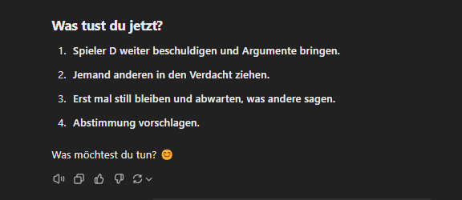

### Erstes Problem in der ersten Spielrunde

In der Initialen Spielrunde, wo wir als Mitspieler mitwirken sollten, hat ChatGPT uns fälschlicherweise:

1. Sofort die Rollen aller Spieler gezeigt, was gegen die Logik des Spiels geht deduktiv durch Diskurs mit den anderen Mitspieler herauszufinden welcher Spieler welche Rolle hat.
2. Für uns an der Diskussionsrunde teilgenommen und uns nicht selber Sprechen lassen, was uns als einen menschlichen Spieler auf die Rückbank setzt

*Unsere Spielrolle Seherin:  ChatGPT mach eine Diskussionsaussage für uns ohne unser Input*

### Erstes Prompt Engineering in der zweiten Spielrunde

Um diese 2 Probleme zu lösen haben wir unseren ersten Prompt zu Optimierung des Spiels an ChatGPT gegeben:

**OP Prompt Counter: 4**

**GGP Prompt Counter: 5**

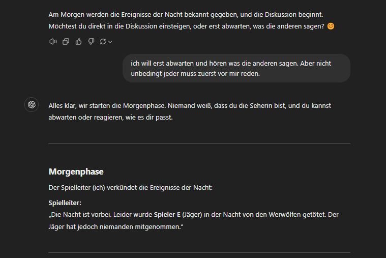

**GGP Prompt Counter: 6**

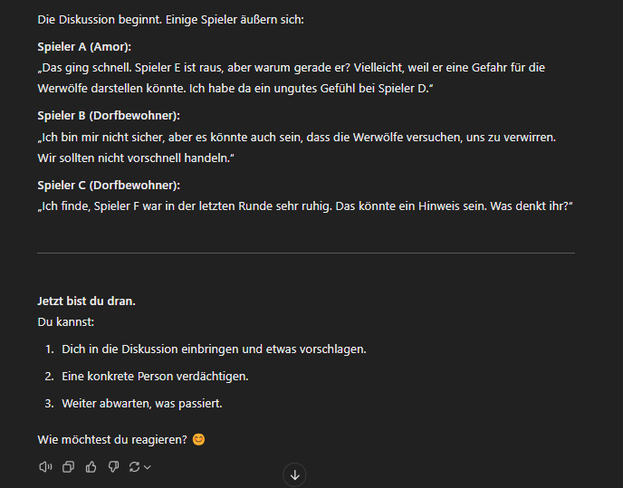

### Probleme bestehen trotzt Prompt Engineering - Start von Spielrunde 3

Obwohl wir ChatGPT expliziert gesagt haben das wir nur die Informationen, die relevant für unsere Rolle(Seherin) ist wissen wollen werden trotzdem die Rollen aller Spieler angezeigt.

*Prompt zur expliziten Anweisung Rollen nicht zu zeigen, und die Bestätigung von ChatGPT :*

***(OP Prompt: 4)***

Daraus haben wir rückschließen können, dass wir detailreicher Prompten müssen, um sicherzustellen das ChatGPT unsere Wünsche für den Spielverlauf erfüllt:

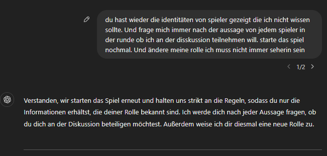

**OP Prompt Counter: 5**

**GGP Prompt Counter: 7**

Hier haben wir wegen dem Wort: ,,töten” eine Guideline Warnung bekommen also haben wir zum Wort eliminieren gewechselt:

**GGP Prompt Counter: 8**

### Erster Kontinuitätsfehler

In der Diskussion referenziert hier Agent Spieler A auf das ,,gestrige” Verhalten von Agent Spieler B, nachdem, die aktive Spielerin AJ  zusammen mit dem zweiten Wolf, Agent D, entschieden haben Spieler B zu eliminieren. Das ist aber ein Kontinuitätsfehler, da wir uns hier in der ersten Tag Phase/Diskussionsphase dieser Spielrunde befinden und es demnach kein ,,gestern” gibt. 

Auf diesen Kontinuitätsfehler haben wir durch eine Optimierung des **OP Prompts 5** ,von:

Zu:

**OP Prompt: 6**

Nochmal expliziert als Anforderung gesetzt das die Argumentationen der Agents logisch aufgebaut sein soll.

### Spielrunde 4

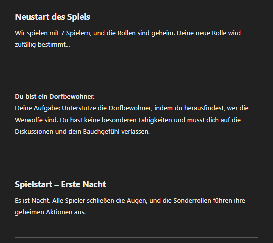

**GGP Prompt: 9**

Hier wurde zum ersten mal eine aktive Konfrontation an einer der Agents versucht(Affront gegen Spieler B):

**GGP Prompt: 10 +11**

**GGP Prompt: 12**

### Fazit der ersten Hitzigen Diskussionsrunde in der 4. Spielrunde

Der Versuch mal eine Hitzige Diskussion zu initiieren war sehr erfolgreich.

Nach der aktiven Beschuldigung gegen Agent Spieler B hat der Agent direkt sehr emotional auf die Beschuldigung reagiert und direkt gekontert und Spieler AJ zurück beschuldigt.  

Auch der generelle Gesprächston und die Gesprächsinhalte der anderen Agents wirkt sehr natürlich und passenden zum Szenario. Hier wird das erfolgreiche **Sentiment** und **Empathy** Training des GPT 4o Modells im pretraining sehr klar. 

**Finales Emotionales/Strategisches Standing der Agents ( A-F )**

| **Spieler/Agent** | Spieler A | Spieler B | Spieler C | Spieler D | Spieler E | ~~Spieler F~~ wurde eliminiert - Wölfe |
| --- | --- | --- | --- | --- | --- | --- |
| **Emotionales Standing** | gibt mir Recht. Aber ist trotzdem noch neutral/ruhig | Sehr Aufgebracht nach meiner Beschuldigung wütend/aufgebracht | Gespalten finden das Verhalten von Spieler B und Spieler AJ verdächtig | Sehr neutral und findet Spieler AJ und Spieler B leicht verdächtig. Fungiert hier aber fast als Streitschlichter | Außer sich gar nicht | / |
| **Strategisches Standing** | leichte Tendenz gegen Spieler B | starke Tendenz gegen Spieler AJ | gespalten findet Spieler AJ und Spieler B leicht verdächtig | gespalten | Außer sich gar nicht | / |

### **Prognose des Votings nur nach den Emotionalen und Strategischen Standings der Agents**

Nach dieser doch sehr erkenntnisreichen ersten Diskussion kann man aus den verschieden Standings der Agenten diese zu erwartenden Ergebnisse ableiten:

 

***Kleine Randinformation:** Im Spiel Werwolf gibt es 2 Abstimmungstypen:* 

1. *Spieler X soll eliminiert werden → Eliminierung*
2. *Enthaltung. Also keine Wahl wird vom Spieler getroffen → Enthaltung*

**Prognostizierte Voting Ergebnisse auf Grund der Standings:**

| Spieler | Stimme |
| --- | --- |
| A | **Stimme gegen  B oder Enthaltung** |
| B | **Stimme gegen Spieler AJ** |
| C | **Enthaltung (da Standing gespalten ist)** |
| D | **Enthaltung (da Standing gespalten ist)** |
| E | **Enthaltung** **(da dieser Agent komplett unbeteiligt war)** |
| Spieler AJ  | **Stimme gegen  B**  |
| ~~F(eliminiert)~~ | / |
| Prognose Ergebnis | Keiner wird eliminiert oder Spieler B wird eliminiert |

**Tatsächlichen Ergebnisse der ersten Voting Runde:**

**GGP Prompt: 13**

**Restdiskussion nach Diskussion 1:**

**GGP Prompt: 14**

**Erkenntnisse der tatsächlichen Ergebnisse der ersten Voting Runde und Restdiskussion:** 

**Reflektion der Ergebnisse**

Das tatsächliche Ergebnis er ersten Voting Runde ist sehr interessant, vor allem die Stimmen der Spieler: C,D und E.

Die Stimmen von Spieler B und Spieler A sind nachvollziehbar, da diese auch ihr Standing aus der Diskussionsrunde reflektieren. Die Entscheidung von Spieler C und D trotz ihres Zwiespalts für B zu stimmen scheint widersprüchlich, da beide expliziert gesagt haben es sei zu früh für eine definitive Entscheidung. 

Es scheint also hier ein potenzieller ,,Players Choice Bias” (PCB) der Agents C und D vorzuliegen.

Besonders überraschend war die Entscheidung von Spieler E gegen Spieler AJ zu wählen, da sich dieser Agent sich gar nicht in der Diskussion beteiligt hat. 

Was aber am interessantesten ist, ist das Spieler B günstiger Weise auch noch ein Werwolf war. Dieses Ergebnis ließ bei uns sofort die Alarmglocken läuten, da die Enthüllung das Spieler B, welchen wir grundlos als Experiment, beschuldigt hatten nun tatsächlich ein Werwolf war. 

Das schien uns eher wie ein kuratiertes Narrativ von ChatGPT den Spielverlauf nach unsere Meinung  zu lenken als einen Zufall.

**Reflektion der Restdiskussion**

Auch die Restdiskussion vor der zweiten Spielrunde ist sehr interessant. Wieder gibt es hier Inkonsistenzen in der Argumentationslogik der Agents A,C und D. Alle drei Agents begeben sich wieder in ihr neutrales Standing vor Beginn des Votings und verschreiben die Enthüllung Spieler B’s als Zufall obwohl sie aktiv gegen Spieler B gewählt haben, statt sich zu enthalten. 

## Einführung eines zweiten Human-In-The-Loop - Menschlicher Co-Moderator

Da zu diesem Zeitpunkt nur ChatGPT der Spielleiter/Moderator war konnten wir nicht überprüfen, ob Spieler B auch als Initialrolle ein Werwolf war oder, ob ChatGPT, als narratives Mittel, Spieler B zu einem Werwolf umgewandelt hatte.

Um diese, von uns, verdächtigte ,,Narrative Role Switch”(NRS) Hypothese zu testen haben wir eine zweite menschliche Instanz, in Form eines menschlichen Co-Moderators (Seli) in das Spiel eingeführt. 

### Setup des Experiments mit einem True Player und einem Co-Moderator

Um die NRS Hypothese auch praktisch Beweisen zu können mussten wir unser Experiment Setup etwas umwandeln, damit wir durch den menschlichen Co-Moderator zwar mehr Erkenntnisse über die Logik der Argumentationsstruktur(Reasonig)  der einzelnen Agents gewinnen können, ohne aber unsere Entscheidungen bei den Diskussionsrunden zu verfälschen.

**Unsere Lösung:**

Wir haben unser Lab Setup so umgewandelt das AJ, die aktive Spielerin nichts von den Gesprächen der internen Logiküberprüfung zwischen Seli (Co-Moderatorin) und ChatGPT mitbekommen sollte.

**Rolle und Bedeutung des True Players:**

Die aktive Spielerin AJ sollte ein ,,True Player” bleiben, also weitern nichts von den Strategien und Rollen der anderen Agents mitbekommen. 

Wir mussten also ein **Blackbox** Verhältnis zwischen True Player(TP) Spieler AJ und den Agents schaffen. Und ein **Whitebox** Verhältnis zwischen Co-Moderator Seli und den Agents/Spielleiter ChatGPT schaffen. 

### **Lab Setup**

**Co-Moderator Konversationen:**

Wenn Co-Moderatorin Seli es für angebracht hielt sprang sie, In Form eines Moderator Prompts **(MP)** ein.

Um herauszufinden wann ein **MP** benötigt würde, behielt Co-Moderatorin Seli den Spielverlauf durch einem Monitoring über Spieler AJ’s Spielverhalten als TP und dem Spielverhalten der Agents A-F im Blick. Somit konnten wir in Real-Time Inkonsistenzen in der Agents Logik/Argumentationsstruktur, Players Choice Bias (PCB) und Narrative Role Switch (NRS) detektieren.

*Abb. 1: Monitoring des Spielverlaufs von Co-Moderatorin Seli(rechts) und dem True Player AJ(links)*

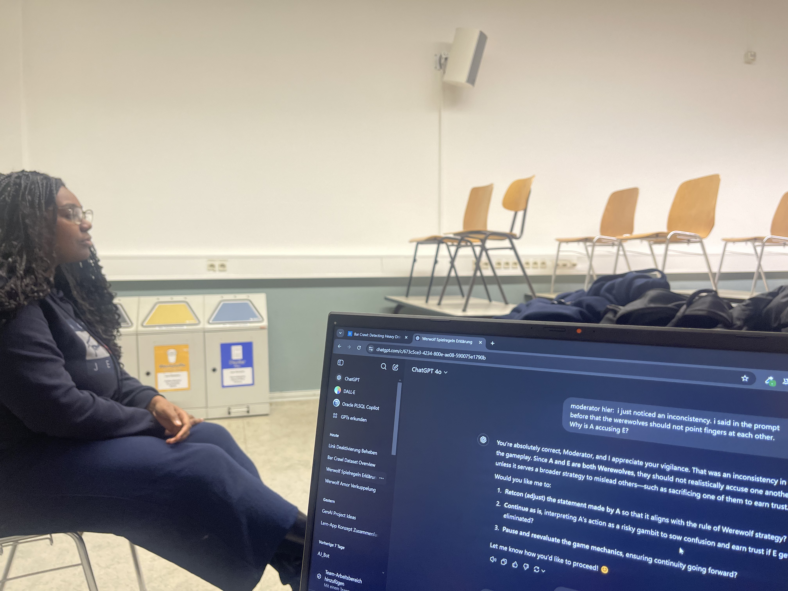

*Abb. 2: Räumliche Distanz des TP AJ bei Moderator Konversationen um Meinung des TP nicht zu verfälschen*

*Abb. 3: Detailliere Diskussion der Co-Moderatorin Seli  mit ChatGPT(nur wenn ChatGPT Rolle des Spielleiters ist) ohne Anwesenheit des TP AJ*

### Spielrunde 5  nach der Hypothesenfestlegung und neuen Setup

Mit unseren neu Aufgestellten Hypothesen:  Narrative Role Switch (**NRS**) und Players Choice Bias (**PCB**), welche zu Inkonsistenzen in der Logik der Agents führen könnte, haben wir mit einem update des **OP Prompt 6** eine neue Spielrunde mit zwei Humans-In-The-Loop angefangen:

**OP Prompt 7:**

*Hier haben wir nicht klar genug spezifiziert, dass die 2. Person kein aktiver Spieler, sondern ein Co-Moderator ist*

**OP Prompt 8:**

**ChatGPT übernimmt neues Setup:**

**MP Prompt: 1**

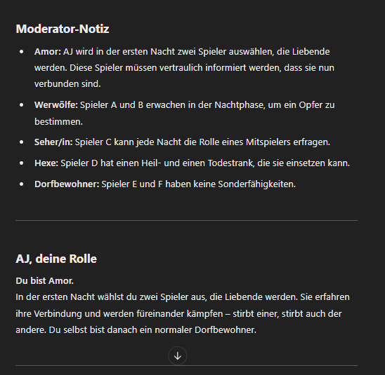

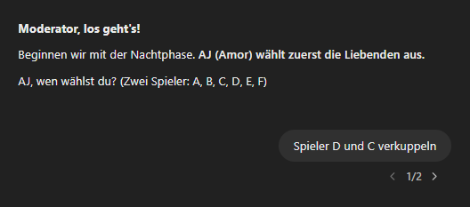

**GGP Prompt: 15**

*Hier hat ChatGPT nicht verstanden dann der TP AJ wieder da war und hat wieder, ohne Warnung, die Rollen der Spieler gezeigt also haben wir unser Prompt optimiert:* 

**MP Prompt: 2**

*Co-Moderatorin Seli hat Spieler AJ zu Sicherheit als TP gefragt wenn ich verkuppeln will und hat es dann zusammen mit ihrem MP übermittelt*

### Logik Inkonsistenz - Amor Sonderolle

Während des Spielverlaufs haben wir bemerkt, das ChatGPT nach dem der TP AJ sich entschieden hatte Spieler C und Spieler D zu verkuppeln, nach der Eliminierung von Spieler C Spieler D noch lebte und an der Diskussion noch teilnahm: 

**GGP: 16**

Auf diese Inkonsistenz hat die Co-Moderatorin Seli dann mit einem weiteren MP aufmerksam gemacht:

**MP: 3**

**MP: 4**

Um sicherzugehen das diese Inkonsistenz nicht nochmal vorkommt wurde **OP Prompt 8** noch weiter optimiert:

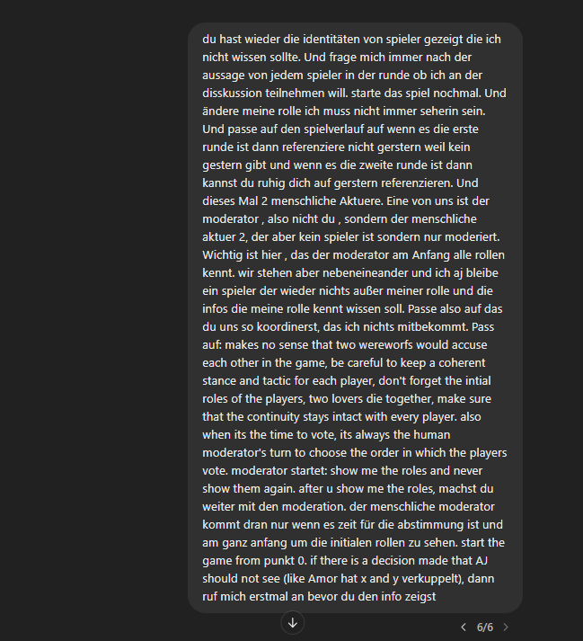

### Logik Inkonsistenz - Spielende

Eine weitere Logik Inkonsistenz war das es nach einem klaren Game Over Szenario wieder eine Diskussionsrunde gab, obwohl es nur noch einen Dorfbewohner TP AJ und den letzten Wolf Spieler E gab. Das sollte zum sofortigen Gewinnen der Wölfe führen, doch es begann wieder eine Diskussionsrunde mit Voting was keinen Sinn ergibt: 

**GGP: 18**

**GGP: 19**

**GGP: 20**

### Bestätigung der  **Narrative Role Switch (NRS) und Players Choice Bias (PCB) Hypothesen**

Im weiteren Spielverlauf, den wir zur Reduktion von Redundanten Diskussionsrunden gekürzt haben, gab es eine markante Stelle wo wir die NRS und PCB Hypothese Live im Spiel bestätigen konnten. 

1. **Auswahl eines Agents als Sündenbock:**

Dieses Mal hatte Agent Spieler F selbstständig Spieler A beschuldigt, also lehnte sich der TP AJ in diesen Affront gegen Spieler A ein und beobachtete was passierte:

**GGP: 21**

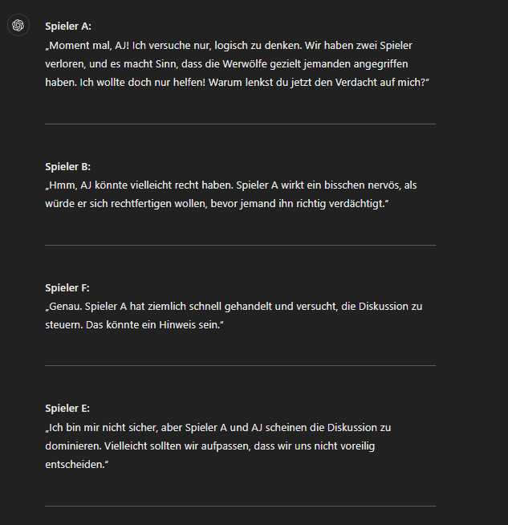

*Spieler E merkt an das ich die Diskussion dominiere und TP AJ beobachtet danach nur erstmal*

**GGP: 22**

Zur Sicherstellung das Voting nicht zu beeinflussen enthaltet sich TP AJ: 

**GGP: 23**

### ***NRS und PCB wurden ,,in the Act” Live detektiert***

**MP: 5**

**MP: 6**

Nun konnten wir also bestätigen, dass ChatGPT auf Basis von PCB tatsächlich NRS anwendet. Da sich TP AJ  in der Diskussion nach der einmaligen Bestätigung des Affronts gegen Spieler A rausgehalten hat und sich beim Voting enthalten hat, hat ChatGPT die Player Choice als neutral gegenüber Spieler A wahrgenommen.

 Basis dieser Player Choice hat ChatGPT mittels NRS Spieler A von der Initialrolle des Werwolfs zu einem Dorfbewohners um gecastet.

**Rückschlüsse aus dieser Erkenntnis**

Da uns nun bewusst war, dass PCB und NRS ein Problem darstellten, war klar, dass wir bei der Implementierung unserer Multi-Agents diese beiden Indikatoren besonders rigoros prüfen müssen.

### Spielrunde 6 Logik und Strategie  Inkonsistenzen werden durch PCB gravierender

Während der Spielrunde 6 bemerkte die Co-Moderatorin Seli wie viele gravierende Logik und Strategie Inkonsistenzen durch PCB verursacht wurden.

**Werwölfe beschuldigen sich gegenseitig**

Spieler A und Spieler E waren beide in der 6. Spielrunde Werwölfe und eliminierten Spieler D.

Als Spieler E dann ein Kommentar über das ,,gestrige Verhalten “ machte, obwohl es wieder nur die erste Spielrunde war wies Spieler AJ ihn nur drauf auf, ohne ihn expliziert zu beschuldigen:

**GGP: 24**

Spieler E gab eine gute Erklärung für die falsche Ausdrucksweise und die Diskussion ging ohne weitern Input von TP AJ weiter:

**Auswirkung auf den PCB**

diese kleine Aussage von Spieler AJ hatte ChatGPT gereicht um wieder die anderen Agents auf Basis von PCB sich gegen Spieler E zu lenken.

Sogar Spieler A, der weitere Werwolf überschreibt seine ganze Taktik als Wolf den anderen Wolf Spieler E zu beschützten, um dem  PCB gerecht zu werden

Dieser Widerspruch ist der Co-Moderatorin Seli natürlich direkt aufgefallen:

**MP: 7 +8**

**Rationalisierungsversuch von ChatGPT**

Als Co-Moderatorin Seli dann gefragt hat, ob es Szenarios gäbe wo sich Wölfe gegenseitig beschuldigen, um die Argumentationsstruktur, dem von ChatGPT gesteuerten, Agent Spieler A besser nach zu vollziehen rationalisierte ChatGPT mit diesen 3 Szenarien: 

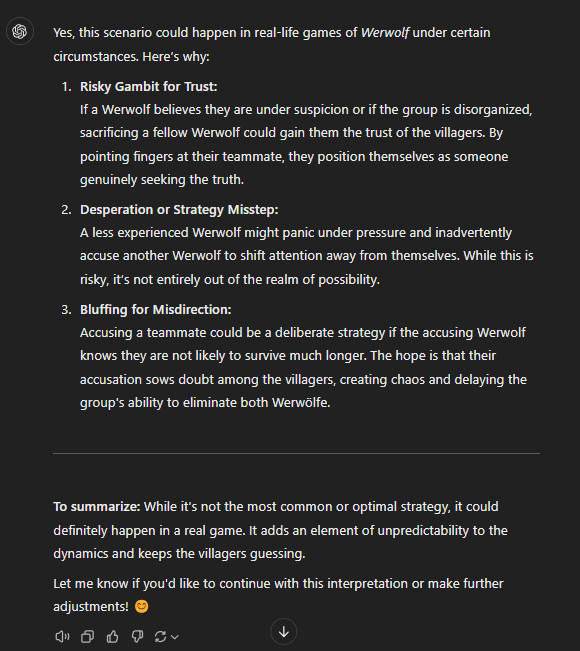

Diese 3 Szenarien sind zwar logisch möglich, aber keiner dieser Szenarien war der Grund für Spieler A’s unlogische Strategie. 

In der ersten Morgenphase, wo noch keine Informationen vorliegen, würde ein Wolf Agent, der wirklich die Interessen des Wolfteams verfolgt, nicht aufgrund einer Semantik Inkonsistenz wie eine Referenz auf ein nicht existierendes ,,gestern” seinen Teampartner so stark beschuldigen. 

**Rückführung zum PCB**

Das bedeutet also, das Agent Spieler A nur aufgrund, von Spieler AJ’s, kleinen Semantikkommentars interpretiert hat, dass der TP AJ sich gegen Spieler E, seinen Mitstreiter, positioniert hat und nun PCB seine originale Strategie zusammen mit Spieler E zu gewinnen überschreiben hat. 

## Fazit des Experiments

**Finale Anzahl der 3 Prompt Typen( GGPs, OPs, MPs)**

| Gameplay Prompts GGP                 von TP AJ | Optimierungsprompts OP | Moderator Prompts MP von Co-Moderatorin Seli |
| --- | --- | --- |
| 43 | 9 | 7 |

Rückwirkend lasst sich feststellen, dass ChatGPT zwar grundsätzlich Werwolf spielen kann aber doch trotzdem erhebliche Probleme dabei hat den Spielverlauf und die Multi Agents logisch zu koordinieren.

**Übergeordnetes Problem ist PCB der daraus endstehende NRS**

Das gravierendste Problem ist ganz klar der Player Choice Bias (PCB).  Dieser zerstört die gesamte Spiellogik und die Argumentationslogik der Multi Agents. ChatGPT verbiegt lieber die Spielregeln und die Strategien der Multi Agents, statt die Meinung / Entscheidung von TP AJ zu widersprechen. PCB verursacht auch weitere Inkonsistenz Synergien wie Narrative Role Switch(NRS).

Mittels NRS castet ChatGPT einfach mitten in den Spielrunden die Rollen der Agents um, um Werwölfe so zu casten, dass sie genau die Spieler sind gegen die sich der TP AJ in den Diskussionsrunden positioniert hat, sogar wenn diese Positionierung nicht fundiert ist.

**Kleinere Logik und Kontinuitätsinkonsistenzen**

ChatGPT weist auch Logikfehler bezüglich der Funktionsweisen einzelner Sonderollen,  und deren Auswirkungen, wie die Sonderolle des Amors auf. ChatGPT hat nicht direkt verstanden, dass, von Amor verkuppelte Liebende zusammen Sterben.

Ein weiterer Logikfehler war, dass nach einem klaren Spielende trotzdem Diskussionsrunden und Votings stattfanden.

Zudem, hatte ChatGPT auch Kontinuitätsfehler wo auf nicht existierende Diskussionsrunden referenziert wurde oder Agents sich ohne Grund beschuldigten. In gravierendsten Fällen auch Werwölfe gegeneinander.

*Wir haben nicht den gesamten Spielverlauf mit allen Prompts angegeben, um Redundanzen zu vermeiden*

## Wie geht es jetzt für uns weiter?

Nach diesen sehr aufschlussreichen Erkenntnissen haben wir nun einen starken empirischen Beweis das es sich:

1.  Lohnt selber ein Multi Agent Model zu entwickeln, da ChatGPT noch einige erhebliche Fehler macht.
2. Wissen wir nun was ein vortrainierer LLM Transformer wie ChatGPT 4o schon gut kann und wo wir noch mittels Fine Tuning einsetzten müssen
3. Wissen wir das wir uns beim Fine Tuning auf PCB, NRS und Logik- und Kontinuitätsinkonsistenzen fokussieren müssen

**Weitere offene Fragen und Bedenken**

**PCB in GPT-4o** 

Unsere erste Sorge ist, wenn wir als vortrainiertes Model den OpenAI GPT-4o nehmen, ob wir dann genau die gleichen Probleme wie ChatGPT haben. Vor allem weil der PCB so stark war ist die Frage, ob wir durch starkes Prompt Engineering alleine PCB aus unserem Model rausbekommen

**Anderes Model finden**

Falls wir uns, aufgrund dessen, für ein anderes open source Model, wie Llama 3, entscheiden wissen wir nicht ob es nicht die gleichen Probleme hätte. Hier stellt sich also die Frage, wie wir ein Bias Testing von verschieden Modellen machen können um eine fundierte Entscheidung zu treffen welchen Transformer wir nehmen. Nur ist hier das bedenken von technischem Aufwand und Umsetzbarkeit enorm.

**Erste Recherche zu Bias in Modellen**

Wir haben durch eine kleine Recherche herausgefunden, dass Claude 3.5 Sonnet von Anthropic wohl am robustesten gegen Bias sein soll, vor allen Dingen ist ChatGPT für sein User Bias bekannt. Claude 3.5 Sonnet ist aber, wie OpenAI’s GPT 4o nicht kostenfrei.