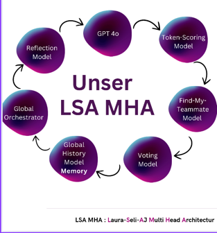

### Stand der Modelle zu diesem Zeitpunkt:

### Herausforderungen:
- Tag- und Nachtphasen haben nicht richtig funktioniert
- teilweise statische Antworten ChatGPT

### Evaluation auf Basis der festgesetzten Punkte:
• Win- Evaluation (KI vs. Mensch) 
• Welche Rollen gewinnen oft
• Korrektheit, logische Fehler?

### Win- Evaluation (KI vs. Mensch):
- konnte nicht richtig gesagt werden, weil die gesamte Funktion des Spiels noch nicht so optimal war, als dass dieser Punkt
schon eine wichtige Rolle gespielt hätte.

### Welche Rollen gewinnen oft?
- konnte nicht richtig gesagt werden, weil die gesamte Funktion des Spiels noch nicht so optimal war, als dass dieser Punkt
schon eine wichtige Rolle gespielt hätte.

### Korrektheit, logische Fehler?
- das Spiel ist langwierig und die Meinung des Human Players wird nicht immer "ernst" genommen -> das zeigt sich daran, dass die anderen Agents nach gemeinsamer Zustimmung
mit dem Human Player anfangen, sich zu wiederholen, anstatt, dass ein Spieler eliminiert wird.
siehe: ([Ausarbeitung_Prompts](../Research_Docs/App_Ansaetze_und_Paperversionierung/Ausarbeitung_Prompts_v2.pdf))

