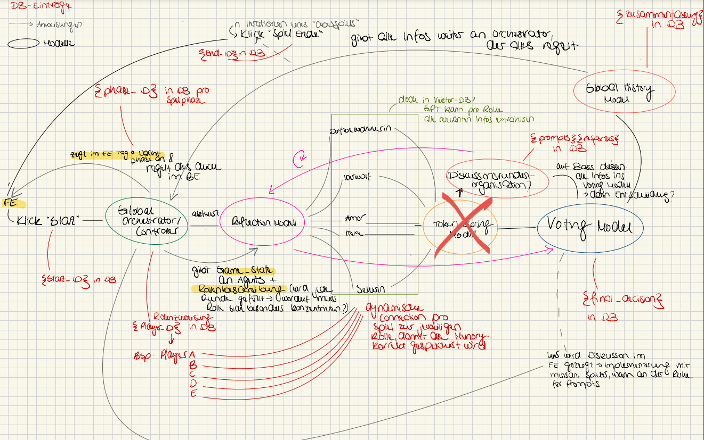

# **Architekturübersicht: WerewolfIQ Spielfluss mit Modulen**

Diese Architektur beschreibt eine modulare Struktur für den Werewolf-Spielfluss, bei der der **Orchestrator** als zentraler Controller fungiert und die Module für spezifische Aufgaben verantwortlich sind. Die Logik wird aus dem Orchestrator ausgelagert, sodass dieser nur Module koordiniert.  
Diese Architektur basiert auf der gemeinsamen Idee von Laura und AJ zur Modularisierung der Spiellogik.  

 + 

---

## **Modulübersicht**

### 1. **Orchestrator**
- **Funktion**: 
  - Koordiniert den gesamten Spielablauf, einschließlich Nacht- und Tagphasen.
  - Ruft die entsprechenden Module auf und leitet deren Ergebnisse weiter.
- **Verantwortung**:
  - Enthält keine Logik oder Entscheidungsfindung.
  - Verwaltet die Übergänge zwischen Phasen.

---

### 2. **GameState-Modul**
- **Funktion**: 
  - Verwaltung des gesamten Spielstatus.
  - Beinhaltet Daten zu Rollen, verbleibenden Spielern, Gesprächsprotokollen und vergangenen Runden.
- **Verantwortung**:
  - Speicherung und Aktualisierung von Spielinformationen.
  - Bereitstellung von Methoden zur Manipulation des Spielstatus.
- **Beispiele für Methoden**:
  - `initialize_roles(player_ids, strategies)`: Weist Rollen den Spielern zu.
  - `get_valid_targets(current_player)`: Gibt gültige Ziele zurück, basierend auf den Spielregeln.
  - `add_to_conversation_log(player_id, statement)`: Protokolliert Aussagen.

---

### 3. **Reflection-Modul**
- **Funktion**: 
  - Führt **individuelle Entscheidungsfindungen** für Spieler basierend auf Rolle, Strategie und Spielstatus durch.
- **Verantwortung**:
  - Generiert kontextuelle Empfehlungen für Spieleraktionen.
  - Stellt temporale Konsistenz sicher (z. B. keine Referenzen auf nicht existierende Ereignisse).
- **Beispiele für Methoden**:
  - `reflect(player, round_number, phase)`: Liefert eine Entscheidung basierend auf dem aktuellen Kontext.
- **Integration**:
  - Nutzt Daten aus GameState und arbeitet eng mit PromptBuilder und GPTInteraction-Modul zusammen.

---

### 4. **PromptBuilder-Modul**
- **Funktion**: 
  - Generiert GPT-Prompts basierend auf Rolle, Phase und Spielsituation.
- **Verantwortung**:
  - Erstellung von Prompts für Nacht- und Tagphasen.
  - Hinzufügen von temporalen Warnungen (z. B. in der ersten Runde).
- **Beispiele für Methoden**:
  - `build_night_prompt(...)`: Erstellt Prompts für die Nachtphase.
  - `build_day_prompt(...)`: Erstellt Prompts für die Tagphase.

---

### 5. **GPTInteraction-Modul**
- **Funktion**: 
  - Schnittstelle zu GPT.
  - Sendet Prompts und verarbeitet Antworten.
- **Verantwortung**:
  - Fehlerbehandlung und Logging von GPT-Interaktionen.
  - Weiterleitung der Entscheidungen an Reflection und Voting.
- **Beispiele für Methoden**:
  - `get_suggestion(prompt, valid_targets)`: Liefert eine GPT-basierte Empfehlung.

---

### 6. **Moderator-Modul**
- **Funktion**: 
  - Verantwortlich für die Steuerung der Phasenübergänge.
  - Sorgt für klare Anweisungen und Koordination der Spielphasen.
- **Verantwortung**:
  - Startet Phasen und kündigt Übergänge an.
  - Informiert Spieler über Eliminierungen und Statusänderungen.
- **Beispiele für Methoden**:
  - `handle_phase_transition(phase, round_number)`: Organisiert den Übergang zwischen Phasen.
  - `announce_elimination(player, role)`: Teilt Spielern Eliminierungen mit.

---

### 7. **Voting-Modul**
- **Funktion**: 
  - Verwaltung von Nacht- und Tagphasen.
  - Organisation von Diskussionen und Abstimmungen.
- **Verantwortung**:
  - Prüfung auf Konsens bei Eliminierungen.
  - Verwaltung des Abstimmungsprozesses.
- **Beispiele für Methoden**:
  - `night_phase(round_number)`: Führt die Diskussion und Konsensfindung der Werwölfe durch.
  - `day_phase(eliminated_player, round_number)`: Organisiert Diskussionen und Abstimmungen aller Spieler.
  - `resolve_votes(votes)`: Bestimmt den Spieler mit den meisten Stimmen.

---

### 8. **ConsensusChecker-Modul**
- **Funktion**: 
  - Überprüfung von Konsensentscheidungen basierend auf Gesprächsprotokollen und GPT-Antworten.
- **Verantwortung**:
  - Analyse der Protokolle auf Stimmen und Übereinstimmungen.
  - Übergibt Konsensentscheidungen an das Voting-Modul.
- **Beispiele für Methoden**:
  - `check_consensus(game_state, current_player)`: Prüft auf Konsens innerhalb der Spielprotokolle.

---

### 9. **GlobalHistory-Modul**
- **Funktion**: 
  - Archiviert den gesamten Spielverlauf und speichert relevante Daten.
- **Verantwortung**:
  - Speicherung von Gesprächsprotokollen und Ergebnissen jeder Runde.
  - Erstellung einer Spielzusammenfassung.
- **Beispiele für Methoden**:
  - `archive_game_state(game_state)`: Speichert den aktuellen Status.
  - `record_event(event_type, details)`: Archiviert relevante Ereignisse.

---

## **Ablauf der Architektur**

1. **Spielstart**:
   - Der Orchestrator initialisiert GameState und startet die Nachtphase.
2. **Nachtphase**:
   - Der Orchestrator ruft das Voting-Modul auf.
   - Das Reflection-Modul analysiert die Rollen und generiert Entscheidungen.
   - Konsensprüfung erfolgt durch das ConsensusChecker-Modul.
3. **Tagphase**:
   - Der Orchestrator ruft das Voting-Modul auf.
   - Diskussionen und Abstimmungen werden organisiert.
   - Das Reflection-Modul liefert Handlungsempfehlungen.
4. **Spielende**:
   - Der GlobalHistory-Modul speichert den Verlauf und die Ergebnisse.

---

## **Vorteile der Architektur**
- **Modularität**: Klare Trennung der Verantwortlichkeiten erleichtert Erweiterungen und Wartung.
- **Flexibilität**: Leicht anpassbar an neue Rollen, Strategien oder Spiellogiken.
- **Skalierbarkeit**: Neue Features oder Spieler können problemlos integriert werden.
- **Transparenz**: Fehler und Konflikte sind durch die klare Struktur leichter zu identifizieren.

---

## **Zusammenfassung**
Das Design der Architektur kombiniert Modularität mit Flexibilität, um eine robuste Grundlage für den WerewolfIQ Spielfluss zu schaffen. 
Während der Orchestrator die Koordination übernimmt, stellen spezialisierte Module die Logik und Entscheidungsfindung bereit.