### Formeln sind in diesen Dokumenten nochmal erklärt: 
#### [Werwolf Abstract v1.pdf](../App%20Ans%C3%A4tze%20und%20Paperversionierung/Werwolf%20Abstract%20v1.pdf)
#### [Multi agent game tatic.pdf](../../references/Papers_Framworks/Multi%20agent%20game%20tatic.pdf)

### **Self-Perspective**

##### Englisch:

##### Deutsch:

-------------------------------------------------------------------------------------

## RAUS da in Werwolf die eigene Role bekannt ist, Ma also in den Formeln nicht mitbetrachen da die Rolle dem Agent mit als Input gegeben wird
### **Identity-Determination** 

##### Englisch:

##### Deutsch:

-----------------------------------------------------------------------------------

### **Self-Reflection**

 ##### Englisch:
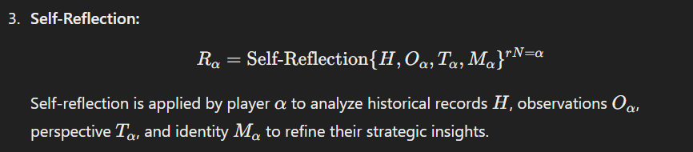

##### Deutsch:

-----------------------------------------------------------------------------------

### **Summary Order**

##### Englisch:
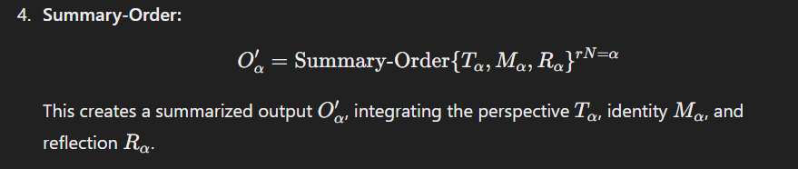

##### Deutsch:

----------------------------------------------------------------------------------
### **Updating Observations: O’α**

##### Englisch:
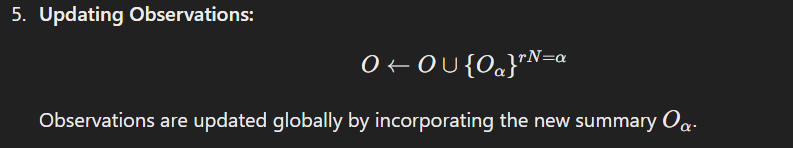

##### Deutsch:

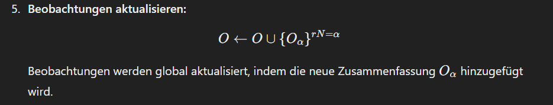

### **Unterschied von Oα und O'α**

##### Erklärung:

##### Nochmal an den gleichungen gezeigt:

##### Zusammenfassung:

----------------------------------------------------------------------------------

### **Word-Speak**

##### Englisch:

##### Deutsch:

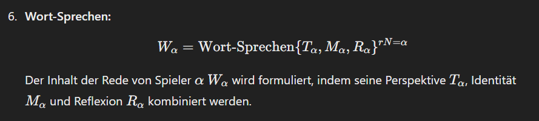

----------------------------------------------------------------------------------

### **Updating Historical Records**

##### Englisch:

##### Deutsch:

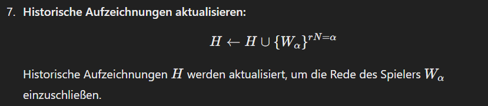

----------------------------------------------------------------------------------

### Phase 2 Refections on the Voting Sessions

### **First-FindTeammate**

##### Englisch:

##### Deutsch:

----------------------------------------------------------------------------------
### **Second-FindTeammate**

##### Englisch:

##### Deutsch:

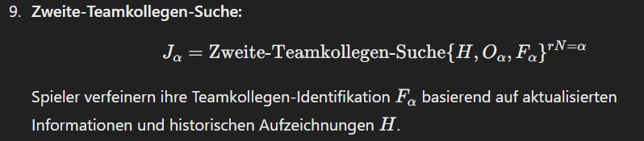

----------------------------------------------------------------------------------

### **Unsere selbst entwickelte neue Formel, um die Dynamik der Spielrunden besser zu modellieren:**

### **X-FindTeammate**

##### Englisch:

-
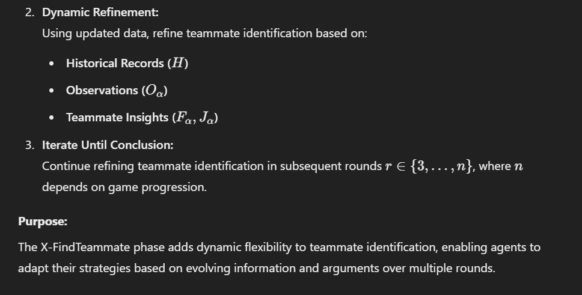

##### Deutsch:

-
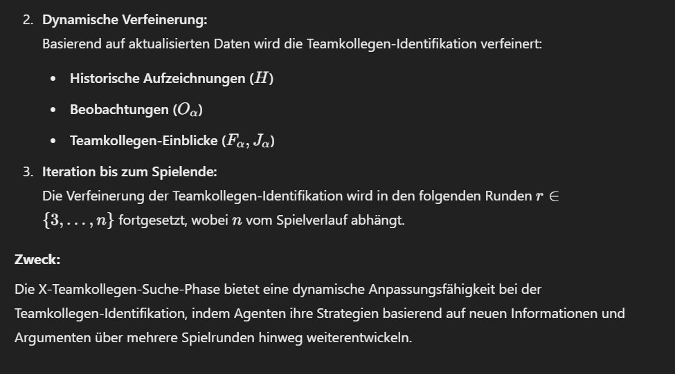

### Punkte, wo wir die Formel und die Implementierung noch mehr Anpassen müssen und Vorsichtig sein müssen:

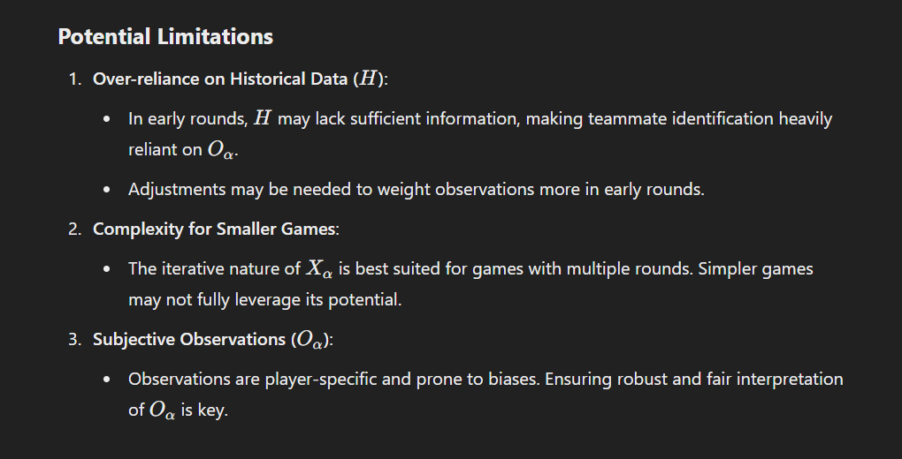
-
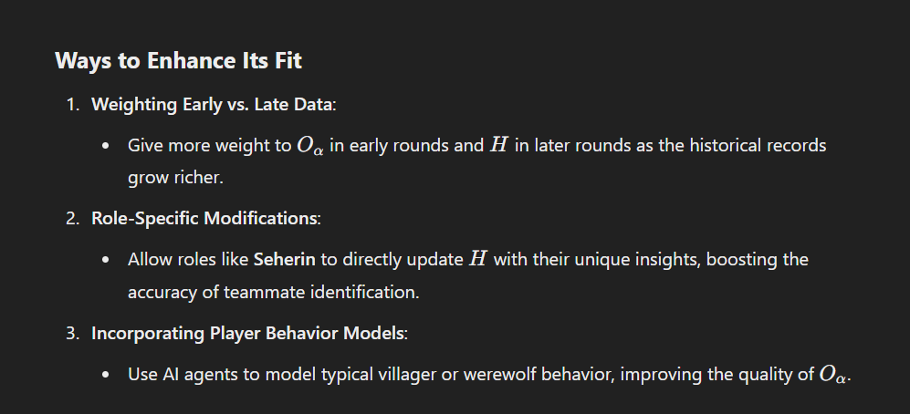
----------------------------------------------------------------------------------

###  **Game-Decision**

##### Englisch:
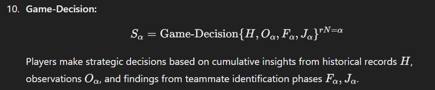

##### Deutsch:

----------------------------------------------------------------------------------

### **Word-Vote** 

##### Englisch:

##### Deutsch:

----------------------------------------------------------------------------------
### Target Variables

| **#** | **Variable**         | **Description**                                                                                          | **Target Type**   |
|-------|-----------------------|----------------------------------------------------------------------------------------------------------|-------------------|
| 1     | **VictoryRate (VR)** | Measures the probability of winning the game                                                             | Team Target       |
| 2     | **SR@1**             | Survival Rate in the First Round                                                                         | Individual Target |
| 3     | **SR@2**             | Survival Rate in the Second Round (Werwolf doesn’t have a fixed amount of rounds)                        | Individual Target |
| 4     | **SR@X**             | Survival Rate after each consecutive round                                                               | Individual Target |
| 5     | **X = number of rounds r** | (X **∈ {3,...,n})**                                                                                     | /                 |
| 6     | **PSA**              | Measures the team’s ability to recognize teammates and identify opponents                                | Team Target       |
| 7     | **PST** (Dorfbewohner) | Probability of Successfully Trusting Own Team                                                           | Individual Target |

